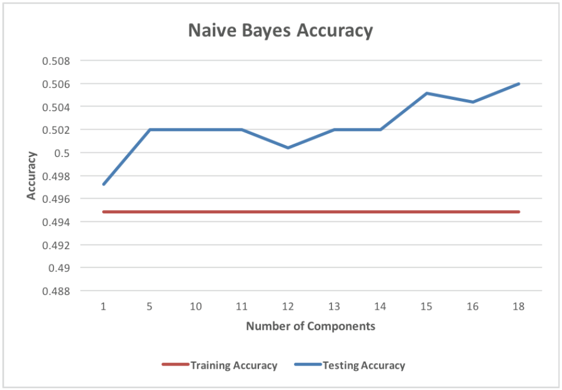
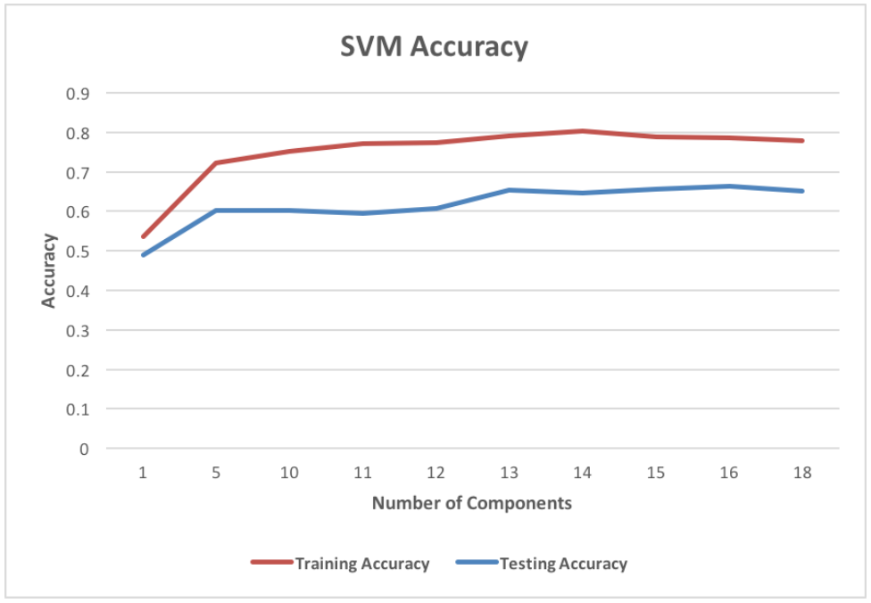

## Paper & associated research

Read the associated<a href="https://www.researchgate.net/publication/320310808_Density-based_Clustering_of_Workplace_Effects_on_Mental_Health"> IEEE-style research paper</a>

## Goal

To gauge which employer-related factors contribute to employees in the tech industry are with seeking help related to mental health issues.

## Execution strategy

We used PCA to reduce the dimensionality of survey responses in the dataset, then clustered these responses with DBSCAN. To classify, we compared two different methods - a Naives Bayes Classifier and a Support Vector Machine (SVM). 

The SVM ultimately performed better. SVMs are a perfect candidate given the relatively small volume of our dataset. 

- Identify clusters against the mental illness binary (i.e. the 'Do you currently have a mental health disorder?') while considering all other attributes at once  
- Identify contrasting clusters (YES/NO/No Preference) based on the mental illness binary while considering each attribute one by one iteratively.
  
Use DBSCAN clustering to identify and separate data into different clusters. Obtain the number of clusters. To classify data, run SVM.

## Results

	

		
		 
		 
	

	

		
		 
		 
	

## Learnings
- The dataset used was fairly limiting. Our testing and training models didn't perform optimally with both Navie Bayes nor SVM classifiers as a result.
- We could've invested more effort into developing more effective de-noising strategies for the dataset.
- There needs to be an extra step of data clean-up prior to PCA dimensionality reduction. This helps eliminate extreme outliers.

## Dataset

https://www.kaggle.com/osmi/mental-health-in-tech-survey
 
https://www.kaggle.com/osmi/mental-health-in-tech-2016/version/1

## Contributors

Shruti Appiah, Sam Barnard, and Jonathan Deiven

## License
